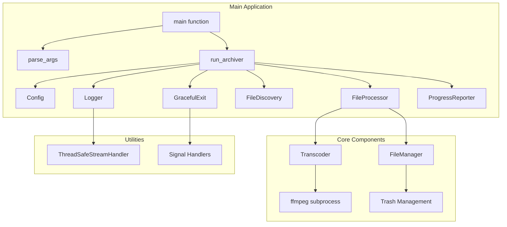
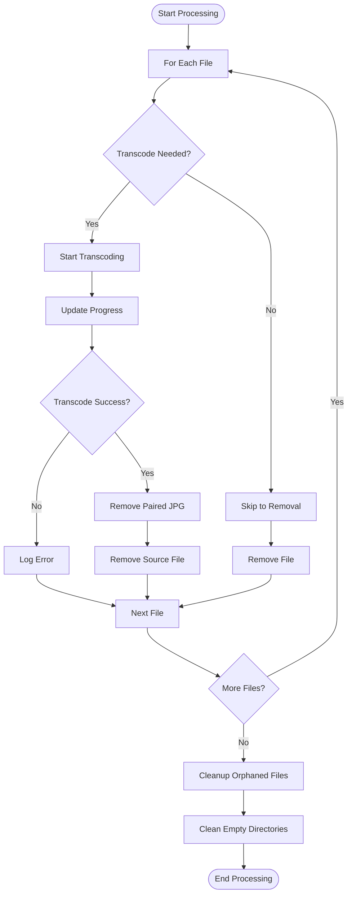
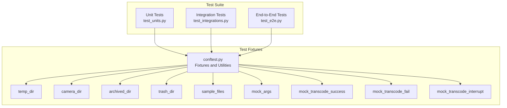
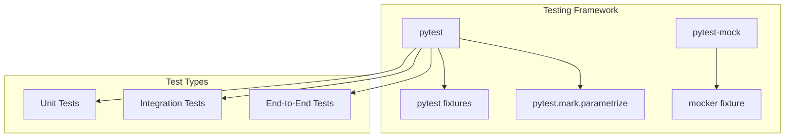
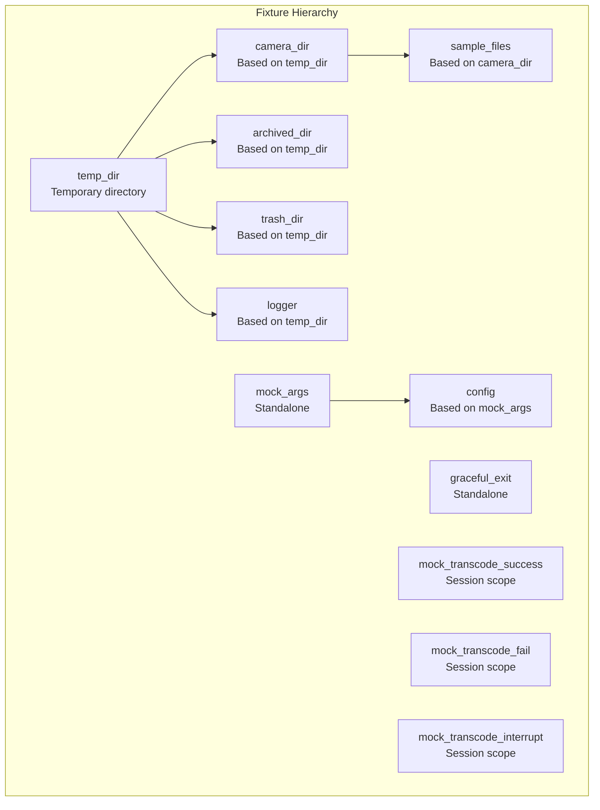
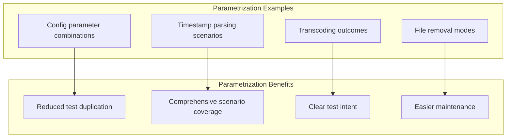
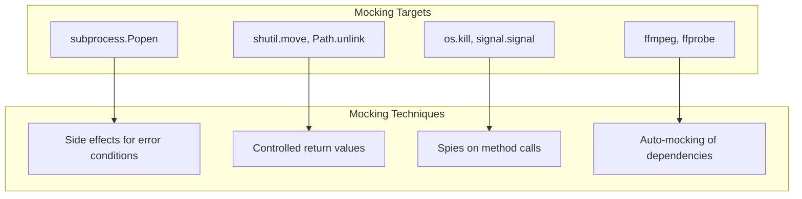
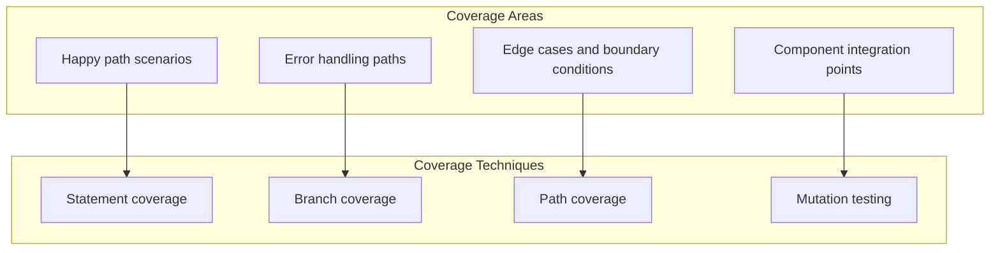

# Camera Archiver Design Document

## Overview

Our camera archiver is a Python application that discovers, transcodes, and archives Reolink camera footage, that has been uploaded to an FTP server directory, based on timestamp parsing, with intelligent cleanup based on size and age thresholds. It uses ffmpeg with QSV (Intel) hardware encoding acceleration (for use with NAS devices that use common Intel chips) for video transcoding and provides a robust file management system with trash support.

## Architecture

## System Components

### Config

Configuration holder that processes command-line arguments and provides a centralized configuration object.

### FileDiscovery

Discovers camera files with valid timestamps in the expected directory structure (`/camera/YYYY/MM/DD/*.*`). It also scans trash and output directories when needed.

### Transcoder

Handles video transcoding using ffmpeg with QSV hardware acceleration. It provides progress callbacks and supports graceful interruption.

### FileManager

Manages file operations including moving to trash, permanent deletion, and cleaning empty directories.

### FileProcessor

Orchestrates the file processing workflow, generating action plans and executing them.

### ProgressReporter

Provides thread-safe progress reporting with time estimates and visual progress bars.

### Logger

Sets up logging with rotation support and thread-safe console output.

### GracefulExit

Handles graceful shutdown when signals are received.

## Workflow

## File Processing Workflow

## Test Design

### Test Structure

### Testing Framework

The Camera Archiver uses pytest and pytest-mock for comprehensive testing:

### Test Fixtures

The test suite relies heavily on fixtures defined in `conftest.py`:

### Parametrization Strategy

The test suite uses parametrization to test multiple scenarios efficiently:

### Mocking Strategy

The test suite uses pytest-mock for mocking external dependencies:

### Test Organization

The test suite is organized into three main categories:

1. **Unit Tests** (`test_units.py`):
   - Test individual components in isolation
   - Heavy use of mocking to isolate components
   - Extensive parametrization for edge cases
   - Focus on business logic and error handling

2. **Integration Tests** (`test_integrations.py`):
   - Test component interactions
   - Limited mocking to preserve real interactions
   - Focus on data flow between components
   - Test error propagation across components

3. **End-to-End Tests** (`test_e2e.py`):
   - Test complete workflows
   - Minimal mocking to preserve real behavior
   - Focus on user-facing functionality
   - Test system-level error handling

### Test Implementation Guidelines

1. **Fixture Usage**:
   - Use fixtures from `conftest.py` whenever possible
   - Create composable fixtures that build on each other
   - Use appropriate fixture scopes (function, session)
   - Leverage auto-use fixtures for common setup

2. **Parametrization**:
   - Use `pytest.mark.parametrize` for testing multiple scenarios
   - Group related parameters together
   - Use descriptive parameter IDs
   - Consider using `pytest.mark.parametrize` for error cases

3. **Mocking**:
   - Use the `mocker` fixture from pytest-mock
   - Mock at the appropriate level (method vs. module)
   - Use side effects for error conditions
   - Verify mock calls when testing interactions

4. **Assertion Strategy**:
   - Use specific assertions with clear messages
   - Test both positive and negative cases
   - Verify state changes and side effects
   - Use pytest's built-in assertion introspection

5. **Test Organization**:
   - Group related tests in classes
   - Use descriptive test method names
   - Document complex test scenarios
   - Keep tests focused and independent

### Test Coverage Strategy

## Error Handling

The system implements comprehensive error handling at multiple levels:

1. **File Operations**: Handles missing files, permission errors, and disk space issues
2. **Transcoding**: Handles ffmpeg errors, missing dependencies, and hardware acceleration failures
3. **Signal Handling**: Gracefully handles SIGINT, SIGTERM, and SIGHUP
4. **Logging**: Handles log rotation errors and file permission issues

## Configuration

The system accepts the following command-line arguments:

- `directory`: Input directory containing camera footage (default: /camera)
- `-o, --output`: Output directory for archived footage
- `--dry-run`: Show what would be done without executing
- `-y, --no-confirm`: Skip confirmation prompts
- `--no-skip`: Don't skip files that already have archives
- `--delete`: Permanently delete files instead of moving to trash
- `--trash-root`: Root directory for trash
- `--cleanup`: Clean up old files based on age and size
- `--clean-output`: Also clean output directory during cleanup
- `--age`: Age in days for cleanup (default: 30)
- `--log-file`: Log file path

## Dependencies

- Python 3.7+
- pytest and pytest-mock for testing
- ffmpeg with QSV hardware acceleration support
- Standard library modules: argparse, logging, os, re, shutil, signal, subprocess, sys, threading, time, datetime, pathlib, typing
