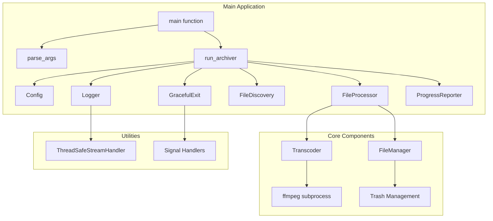
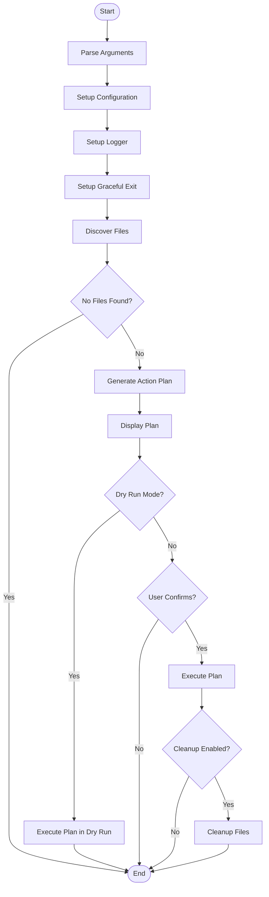
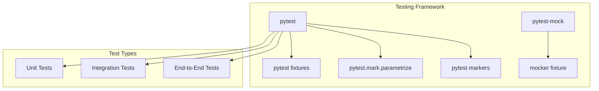
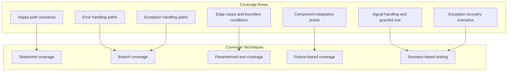

# Camera Archiver Design Document

## Overview

Our camera archiver is a Python application that discovers, transcodes, and archives Reolink camera footage, that has been uploaded to an FTP server directory, based on timestamp parsing, with intelligent cleanup based on size and age thresholds. It uses ffmpeg with QSV (Intel) hardware encoding acceleration (for use with NAS devices that use common Intel chips) for video transcoding and provides a robust file management system with trash support.

## Architecture



## System Components

### Config

Configuration holder that processes command-line arguments and provides a centralized configuration object.

- Handles special case where delete flag overrides trash root setting
- Manages output directory path resolution
- Processes multiple configuration sources (defaults, command-line args, etc.)

### FileDiscovery

Discovers camera files with valid timestamps in the expected directory structure (`/camera/YYYY/MM/DD/*.*`). It also scans trash and output directories when needed.

- Supports parsing timestamps from both regular camera files (`REO_<zone>_<num>_<timestamp>.mp4`) and archived files (`archived-<timestamp>.mp4`)
- Implements thorough timestamp validation (year range 2000-2099)
- Scans multiple directory locations: input, trash, and output directories when clean_output is enabled
- Handles complex directory path validation to ensure proper YYYY/MM/DD structure

### Transcoder

Handles video transcoding using ffmpeg with QSV hardware acceleration. It provides progress callbacks and supports graceful interruption.

- Includes video duration detection using ffprobe
- Implements error handling for missing dependencies and subprocess failures
- Provides cancellation support during transcoding operations
- Handles stdout streaming and progress calculation based on elapsed time vs total duration
- Includes proper resource cleanup for subprocess management

### FileManager

Manages file operations including moving to trash, permanent deletion, and cleaning empty directories.

- Implements intelligent trash destination calculation with conflict resolution (timestamp-counter suffixes)
- Prevents double-nesting when files are already in trash directories
- Supports atomic file operations with proper error handling
- Handles both input and output file categorization for trash management
- Includes automatic cleanup of empty date-structured directories

### FileProcessor

Orchestrates the file processing workflow, generating action plans and executing them.

- Generates comprehensive action plans with both transcoding and removal operations
- Implements age-based filtering for cleanup operations (skips files newer than age threshold)
- Handles paired JPG file management with orphaned file detection
- Coordinates transcoding success/failure with appropriate file removal strategies
- Manages output path generation with proper directory structure

### ProgressReporter

Provides thread-safe progress reporting with time estimates and visual progress bars.

- Implements global OUTPUT_LOCK coordination with logging system
- Supports silent mode for dry-run operations
- Provides elapsed time formatting (with hour display when needed)
- Includes proper context manager support for cleanup
- Handles graceful exit coordination during progress updates

### Logger

Sets up logging with rotation support and thread-safe console output.

- Implements log file rotation based on size thresholds (4MB)
- Includes thread-safe stream handler to coordinate with progress reporting
- Handles log directory creation with error recovery
- Supports multiple backup file management during rotation
- Provides file and console handlers with UTF-8 encoding

### GracefulExit

Handles graceful shutdown when signals are received.

- Provides thread-safe exit flag management
- Supports signal handlers for SIGINT, SIGTERM, and SIGHUP
- Integrates with all major components for cancellation support
- Coordinates shutdown messages with OUTPUT_LOCK

## Workflow



## File Processing Workflow


## Test Design

### Test Structure

```mermaid
graph TB
    subgraph "Test Suite"
        UnitTests[Unit Tests<br/>test_units.py]
        IntegrationTests[Integration Tests<br/>test_integrations.py]
        E2ETests[End-to-End Tests<br/>test_e2e.py]
    end

    subgraph "Test Fixtures"
        conftest[conftest.py<br/>Fixtures and Utilities]
        conftest --> temp_dir[temp_dir]
        conftest --> camera_dir[camera_dir]
        conftest --> archived_dir[archived_dir]
        conftest --> trash_dir[trash_dir]
        conftest --> sample_files[sample_files]
        conftest --> mock_args[mock_args]
        conftest --> mock_transcode_success[mock_transcode_success]
        conftest --> mock_transcode_fail[mock_transcode_fail]
        conftest --> mock_transcode_interrupt[mock_transcode_interrupt]
        conftest --> make_camera_file[make_camera_file factory]
        conftest --> make_file_set[make_file_set factory]
        conftest --> mock_subprocess_patterns[mock_subprocess_patterns]
        conftest --> mock_file_operations[mock_file_operations]
        conftest --> transcoder_behavior[transcoder_behavior]
        conftest --> integration_scenario[integration_scenario]
        conftest --> e2e_scenario[e2e_scenario]
        conftest --> file_assertions[file_assertions helper]
        conftest --> plan_assertions[plan_assertions helper]
        conftest --> e2e_outcome_validator[e2e_outcome_validator]
        conftest --> reset_globals[reset_globals autouse]
        conftest --> ffmpeg_mock[ffmpeg_mock]
    end

    UnitTests --> conftest
    IntegrationTests --> conftest
    E2ETests --> conftest
```



### Testing Framework

The Camera Archiver uses pytest and pytest-mock for comprehensive testing:



### Test Fixtures

The test suite relies heavily on fixtures defined in `conftest.py`, including factory fixtures, mock presets, and helper classes:

````mermaid
graph TB
    subgraph "Fixture Hierarchy"
        temp_dir[temp_dir<br/>Temporary directory]
        camera_dir[camera_dir<br/>Based on temp_dir]
        archived_dir[archived_dir<br/>Based on temp_dir]
        trash_dir[trash_dir<br/>Based on temp_dir]
        sample_files[sample_files<br/>Based on camera_dir]
        logger[logger<br/>Based on temp_dir]
        mock_args[mock_args<br/>Standalone]
        config[config<br/>Based on mock_args]
        graceful_exit[graceful_exit<br/>Standalone]
        mock_transcode_success[mock_transcode_success<br/>Session scope]
        mock_transcode_fail[mock_transcode_fail<br/>Session scope]
        mock_transcode_interrupt[mock_transcode_interrupt<br/>Session scope]
        make_camera_file[make_camera_file<br/>Factory fixture]
        make_file_set[make_file_set<br/>Based on make_camera_file]
        mock_subprocess_patterns[mock_subprocess_patterns<br/>Mock presets]
        mock_file_operations[mock_file_operations<br/>Mock presets]
        transcoder_behavior[transcoder_behavior<br/>Parametrized mock]
        integration_scenario[integration_scenario<br/>Parametrized scenario]
        e2e_scenario[e2e_scenario<br/>Parametrized e2e scenario]
        file_assertions[file_assertions<br/>File assertion helper]
        plan_assertions[plan_assertions<br/>Plan assertion helper]
        e2e_outcome_validator[e2e_outcome_validator<br/>E2E validation helper]
        reset_globals[reset_globals<br/>Auto-use fixture]
        ffmpeg_mock[ffmpeg_mock<br/>Process mock factory]
    end

    temp_dir --> camera_dir
    temp_dir --> archived_dir
    temp_dir --> trash_dir
    temp_dir --> logger
    camera_dir --> sample_files
    mock_args --> config
    temp_dir --> make_camera_file
    make_camera_file --> make_file_set
    temp_dir --> logger

### Parametrization Strategy

The test suite uses parametrization extensively to test multiple scenarios efficiently:

```mermaid
graph TB
    subgraph "Parametrization Examples"
        ConfigParams[Config field validation<br/>test_config_fields]
        TimestampParams[Timestamp parsing scenarios<br/>comprehensive tests]
        TranscodeParams[Transcoding outcomes<br/>via transcoder_behavior fixture]
        FileRemovalParams[File removal modes<br/>parametrized tests]
        IntegrationScenarios[Integration scenarios<br/>via integration_scenario]
        E2EScenarios[E2E scenarios<br/>via e2e_scenario]
    end

    subgraph "Parametrization Benefits"
        ReducedDuplication[Reduced test duplication]
        ComprehensiveCoverage[Comprehensive scenario coverage]
        ClearIntent[Clear test intent]
        Maintainability[Easier maintenance]
    end

    ConfigParams --> ReducedDuplication
    TimestampParams --> ComprehensiveCoverage
    TranscodeParams --> ClearIntent
    FileRemovalParams --> Maintainability
    IntegrationScenarios --> ReducedDuplication
    E2EScenarios --> ComprehensiveCoverage
````

### Mocking Strategy

The test suite uses pytest-mock for mocking external dependencies with standardized patterns:

```mermaid
graph TB
    subgraph "Mocking Targets"
        Subprocess[subprocess.Popen]
        FileOperations[shutil.move, Path.unlink]
        SystemCalls[os.kill, signal.signal]
        ExternalTools[ffmpeg, ffprobe]
        Transcoder[Transcoder.transcode_file]
    end

    subgraph "Mocking Techniques"
        StandardPresets[Standard mock presets<br/>mock_subprocess_patterns]
        BehaviorParams[Behavior parametrization<br/>transcoder_behavior fixture]
        FactoryMocks[Mock factories<br/>ffmpeg_mock fixture]
        SessionMocks[Session-scoped mocks<br/>mock_transcode_* fixtures]
    end

    Subprocess --> StandardPresets
    Transcoder --> BehaviorParams
    ExternalTools --> FactoryMocks
    FileOperations --> SessionMocks
```

### Test Organization

The test suite is organized into three main categories with enhanced structure:

1. **Unit Tests** (`test_units.py`):
   - Test individual components in isolation
   - Heavy use of mocking to isolate components
   - Extensive parametrization for edge cases
   - Focus on business logic and error handling
   - New pytest markers: `@pytest.mark.parsing`, `@pytest.mark.file_operations`, `@pytest.mark.transcoding`, etc.
   - Comprehensive parametrized tests for Config, FileDiscovery, and error handling paths
   - 98% coverage with 18 missed lines across 1147 lines of test code
   - Tests for exception handling in Logger, FileManager, and Transcoder components
   - Signal handling and graceful exit tests

2. **Integration Tests** (`test_integrations.py`):
   - Test component interactions
   - Limited mocking to preserve real interactions
   - Focus on data flow between components
   - Test error propagation across components
   - Use of `integration_scenario` fixture for standardized scenarios
   - 99% coverage with 4 missed lines across 430 lines of test code
   - Tests for FileManager with output directory, Transcoder with ProgressReporter
   - Integration tests for Config, Logger, and GracefulExit with other components
   - Tests for run_archiver function with various configurations

3. **End-to-End Tests** (`test_e2e.py`):
   - Test complete workflows
   - Minimal mocking to preserve real behavior
   - Focus on user-facing functionality
   - Test system-level error handling
   - Use of `e2e_scenario` fixture and `E2EOutcomeValidator` for consistent validation
   - 100% coverage across 243 lines of test code
   - Tests for complete workflows with transcoding, cleanup, dry-run, and failure scenarios
   - Tests for user cancellation and exception handling in main execution path

### Test Implementation Guidelines

1. **Fixture Usage**:
   - Use factory fixtures like `make_camera_file` and `make_file_set` for test data creation
   - Use standard mock presets like `mock_subprocess_patterns` and `mock_file_operations`
   - Use parametrized fixtures like `transcoder_behavior` and `integration_scenario`
   - Leverage assertion helper fixtures (`file_assertions`, `plan_assertions`)

2. **Parametrization**:
   - Use `pytest.mark.parametrize` for testing multiple scenarios
   - Use fixture parametrization when appropriate (like `transcoder_behavior`)
   - Group related parameters together
   - Use descriptive parameter IDs
   - Consider using `pytest.mark.parametrize` for error cases

3. **Mocking**:
   - Use the `mocker` fixture from pytest-mock
   - Use standardized mock presets for common scenarios
   - Apply `ffmpeg_mock` for consistent process mocking
   - Use behavior-based parametrization for multiple mock types

4. **Assertion Strategy**:
   - Use assertion helper classes (`FileAssertions`, `PlanAssertions`)
   - Use specific assertions with clear messages
   - Test both positive and negative cases
   - Verify state changes and side effects
   - Use pytest's built-in assertion introspection

5. **Test Organization**:
   - Group related tests in classes with pytest markers
   - Use descriptive test method names
   - Document complex test scenarios
   - Keep tests focused and independent
   - Leverage auto-use fixtures for test isolation

6. **Advanced pytest Features**:
   - Use `reset_globals` auto-use fixture for state isolation
   - Apply pytest markers (`parsing`, `file_operations`, `transcoding`, etc.) for test categorization
   - Use indirect parametrization with fixtures like `integration_scenario`
   - Leverage session-scoped fixtures for expensive operations

### Test Coverage Strategy



### Current Coverage Status

The test suite provides comprehensive coverage of the application:

- **Overall Coverage**: 91% (2,730 lines covered out of 2,995 total lines)
- **Unit Tests**: 98% coverage (1,129 out of 1,147 lines tested)
- **Integration Tests**: 99% coverage (426 out of 430 lines tested)
- **End-to-End Tests**: 100% coverage (243 out of 243 lines tested)
- **Test Suite**: 164 individual test cases across all categories

The test suite includes comprehensive error handling tests for:

- File system operations and permission errors
- Missing dependencies and subprocess failures
- Log rotation and file access issues
- Network/interrupt handling scenarios
- Configuration validation and edge cases

## Error Handling

The system implements comprehensive error handling at multiple levels:

1. **File Operations**: Handles missing files, permission errors, disk space issues, path resolution errors, and trash destination conflicts
2. **Transcoding**: Handles ffmpeg errors, missing dependencies, hardware acceleration failures, subprocess timeouts, and invalid video duration responses
3. **Signal Handling**: Gracefully handles SIGINT, SIGTERM, and SIGHUP with proper cleanup and state coordination
4. **Logging**: Handles log rotation errors, file permission issues, directory creation failures, and encoding problems
5. **Configuration**: Handles path validation, directory existence checks, and argument validation
6. **Network/Process**: Handles subprocess execution failures, dependency availability checks, and resource cleanup during interruptions
7. **Path Operations**: Handles relative path resolution failures, directory nesting issues, and file system access problems

## Configuration

The system accepts the following command-line arguments:

- `directory`: Input directory containing camera footage (default: /camera)
- `-o, --output`: Output directory for archived footage
- `--dry-run`: Show what would be done without executing
- `-y, --no-confirm`: Skip confirmation prompts
- `--no-skip`: Don't skip files that already have archives
- `--delete`: Permanently delete files instead of moving to trash
- `--trash-root`: Root directory for trash
- `--cleanup`: Clean up old files based on age and size
- `--clean-output`: Also clean output directory during cleanup
- `--age`: Age in days for cleanup (default: 30)
- `--log-file`: Log file path

## Dependencies

- Python 3.13+
- pytest (>=8.4.2) and pytest-mock (>=3.15.1) for testing
- slipcover (>=1.0.17) for coverage reporting
- ruff for linting and formatting
- pyright for type checking
- uv for package management
- ffmpeg with QSV hardware acceleration support
- Standard library modules: argparse, logging, os, re, shutil, signal, subprocess, sys, threading, time, datetime, pathlib, typing
