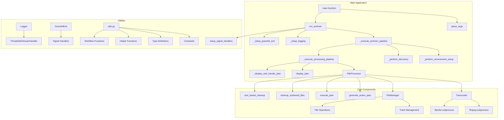
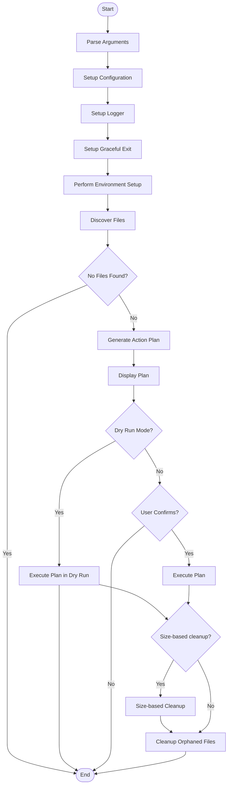
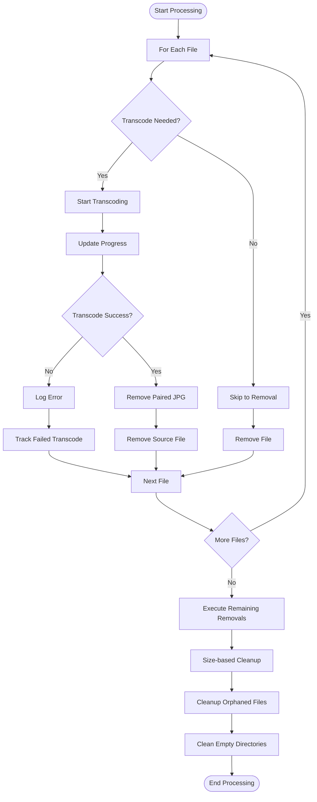
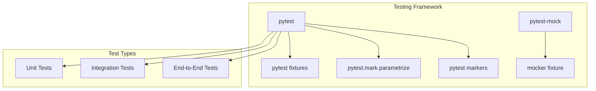
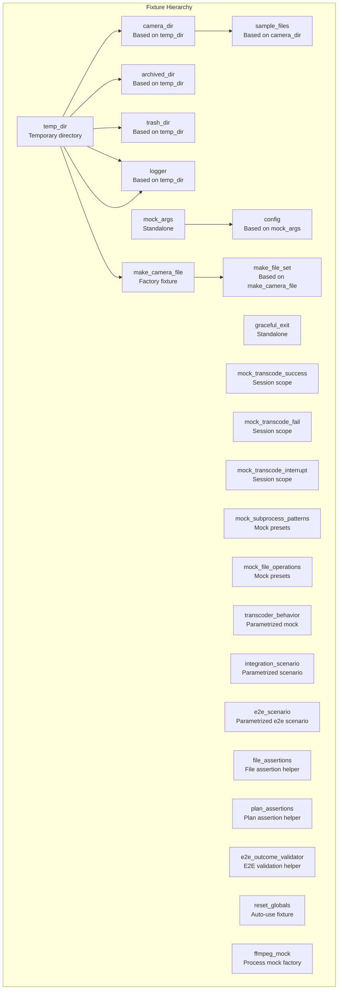
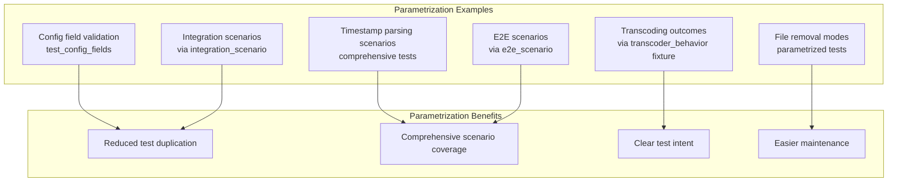
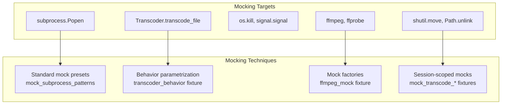
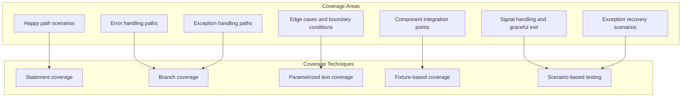

# Camera Archiver Design Document

## Overview

Camera Archiver is a Python application that discovers, transcodes, and archives Reolink camera footage based on timestamp parsing, with intelligent cleanup based on size and age thresholds. It uses ffmpeg with QSV (Intel) hardware encoding acceleration for video transcoding and provides a robust file management system with trash support.

## Architecture



## Core Data Structures and Constants

The application uses several key constants and type definitions:

- **Constants**:
  - `MIN_ARCHIVE_SIZE_BYTES`: Minimum file size (1MB) to skip transcoding if archive already exists
  - `LOG_ROTATION_SIZE`: Log file rotation threshold (4MB)
  - `OUTPUT_LOCK`: Global threading lock for coordinating logging and progress updates
  - `DEFAULT_PROGRESS_WIDTH`: Default width for progress bars (30 characters)
  - `PROGRESS_UPDATE_INTERVAL`: Update interval for non-TTY output (5 seconds)

- **Type Definitions**:
  - `TranscodeAction`: TypedDict for transcoding operations with input, output, and paired JPG file
  - `RemovalAction`: TypedDict for file removal operations with file path and reason
  - `ActionPlan`: TypedDict for action plans containing transcoding and removal lists
  - `FilePath`: Type alias for Path objects
  - `Timestamp`: Type alias for datetime objects
  - `FileSize`: Type alias for file sizes as integers
  - `ProgressCallback`: Type alias for progress callback functions
  - `DiscoveredFiles`: Tuple type for return value of FileDiscovery.discover_files
  - `TimestampFileMapping`: Type alias for timestamp-to-file mapping dictionaries
  - `ActionItem`: Union type for action items to allow both TypedDict and generic dict
  - `ActionPlanType`: Union type for action plans that's compatible with both TypedDict and dict
  - `GenericAction`: Generic dictionary type for action items

- **Utility Functions**:
  - `parse_size()`: Function to parse size strings like '500GB', '1TB' into bytes with support for B, KB, MB, GB, TB units (case-insensitive) and validates format
  - `display_plan()`: Displays the action plan to the user with detailed information about transcoding and removal operations
  - `confirm_plan()`: Handles user confirmation prompts before executing operations
  - `setup_signal_handlers()`: Sets up signal handlers for graceful shutdown on SIGINT, SIGTERM, and SIGHUP
  - `parse_args()`: Parses command-line arguments using argparse
  - `run_archiver()`: Main pipeline function that orchestrates the entire archiving process through discovery, planning, processing, and cleanup stages
  - `main()`: Entry point function that parses arguments and runs the archiver
  - `_setup_environment()`: Sets up the environment by checking directories and creating output directory if needed
  - `_perform_discovery()`: Performs file discovery and returns discovered files
  - `_handle_dry_run_mode()`: Handles the dry run mode execution
  - `_handle_real_execution()`: Handles the real execution mode
  - `_setup_logging()`: Sets up logging for the archiver
  - `_setup_graceful_exit()`: Sets up graceful exit handling
  - `_execute_archiver_pipeline()`: Executes the complete archiver pipeline
  - `_perform_environment_setup()`: Performs environment setup
  - `_should_skip_processing()`: Checks if processing should be skipped
  - `_execute_processing_pipeline()`: Executes the main processing pipeline
  - `_display_and_handle_plan()`: Displays plan and handles execution based on configuration
  - `_handle_real_execution_if_confirmed()`: Handles real execution if user confirms
  - `_is_user_confirmation_required()`: Checks if user confirmation is required
  - `_handle_archiver_error()`: Handles archiver errors with logging

## System Components

### Config

Configuration holder that processes command-line arguments and provides a centralized configuration object with strict typing.

- Handles special case where delete flag overrides trash root setting
- Manages output directory path resolution
- Processes multiple configuration sources (defaults, command-line args, etc.)
- Includes helper methods `_resolve_trash_root()` and `_resolve_output_path()` for path resolution
- Contains fields for all command-line arguments: directory, output, dry_run, no_confirm, no_skip, delete, trash_root, cleanup, clean_output, age, max_size, and log_file
- Defaults max_size to None when not specified
- Defaults log_file to /camera/archiver.log when not specified
- Implements comprehensive validation for all configuration parameters
- Provides type-safe access to configuration values
- Uses Path objects for all directory paths
- Includes strict typing for all configuration fields

### FileDiscovery

Discovers camera files with valid timestamps in the expected directory structure (`/camera/YYYY/MM/DD/*.*`). It also scans trash and output directories when needed.

- Supports parsing timestamps from both regular camera files (`REO_<zone>_<num>_<timestamp>.mp4`) and archived files (`archived-<timestamp>.mp4`)
- Implements timestamp validation (year range 2000-2099)
- Scans multiple directory locations: input, trash, and output directories when clean_output is enabled
- Handles directory path validation to ensure proper YYYY/MM/DD structure
- Implements `_parse_timestamp_from_archived_filename()` method for parsing timestamps from archived files
- Uses `_parse_timestamp()` method to extract timestamps from regular camera filenames
- Returns tuple containing: (list of MP4 files with timestamps, timestamp-to-file mapping, set of trash files)
- Provides comprehensive error handling for invalid directory structures and file formats
- Includes detailed logging for discovery process and validation results
- Uses static methods for all operations with strict typing
- Implements `_validate_directory_structure()` for directory structure validation
- Uses `_validate_file_type()` for file type validation
- Implements `_validate_file_structure()` for file structure validation
- Uses `_process_file()` for individual file processing
- Implements `_scan_directory()` for directory scanning
- Uses `_process_file_if_valid()` for conditional file processing

### Transcoder

Handles video transcoding using ffmpeg with QSV hardware acceleration. It provides progress callbacks and supports graceful interruption.

- Includes video duration detection using ffprobe
- Implements error handling for missing dependencies and subprocess failures
- Provides cancellation support during transcoding operations
- Handles stdout streaming and progress calculation based on elapsed time vs total duration
- Includes proper resource cleanup for subprocess management
- Extracted helper methods for improved testability:
  - `_build_ffmpeg_command()`: Builds the ffmpeg command with appropriate parameters
  - `_parse_ffmpeg_time()`: Parses time string from ffmpeg output and converts to seconds
  - `_calculate_progress()`: Calculates current progress percentage based on ffmpeg output
  - `_process_ffmpeg_output()`: Processes ffmpeg output stream and reports progress
  - `_process_ffmpeg_output_with_state()`: Processes ffmpeg output with state management
  - `_should_exit_gracefully()`: Checks if graceful exit is requested
  - `_update_progress_callback()`: Updates progress callback during transcoding
  - `_handle_dry_run()`: Handles dry run mode for transcoding
  - `_setup_output_directory()`: Sets up output directory for transcoding
  - `_start_ffmpeg_process()`: Starts ffmpeg process
  - `_cleanup_ffmpeg_process()`: Cleans up ffmpeg process
  - `_close_process_stdout()`: Closes process stdout
  - `_wait_for_process_completion()`: Waits for process completion
  - `_terminate_process_with_timeout()`: Terminates process with timeout
  - `_handle_ffmpeg_stdout_error()`: Handles ffmpeg stdout errors
  - `_handle_graceful_exit()`: Handles graceful exit during transcoding
  - `_log_ffmpeg_output()`: Logs ffmpeg output
  - `_handle_ffmpeg_completion()`: Handles ffmpeg completion
- Supports dry-run mode that simulates transcoding without actual file modifications
- Creates output directory when needed before transcoding
- Includes timeout handling for subprocess operations
- Provides debugging support with detailed ffmpeg output logging when in debug mode
- Uses subprocess.Popen for non-blocking execution of ffmpeg
- Implements proper subprocess termination handling for cancellation scenarios
- Includes support for hardware acceleration via QSV with scale_qsv filter
- Provides comprehensive error handling for various transcoding failure scenarios
- Includes detailed logging for transcoding process and progress updates
- Uses static methods for all operations with strict typing

### FileManager

Manages file operations including moving to trash, permanent deletion, and cleaning empty directories.

- Implements intelligent trash destination calculation with conflict resolution (timestamp-counter suffixes)
- Prevents double-nesting when files are already in trash directories
- Supports atomic file operations with proper error handling
- Handles both input and output file categorization for trash management
- Includes automatic cleanup of empty date-structured directories
- Extracted helper methods for improved testability:
  - `_calculate_trash_subdirectory()`: Calculates trash subdirectory based on file type (input/output)
  - `_calculate_trash_destination()`: Calculates destination path in trash with logic to prevent double nesting when files are already in trash directories, including conflict resolution with timestamp-counter suffixes
  - `_remove_file_with_strategy()`: Removes file with appropriate strategy (trash or delete)
  - `_move_to_trash()`: Moves file to trash directory
  - `_delete_file()`: Deletes file permanently
  - `_get_relative_path_without_double_nesting()`: Gets relative path without double nesting
  - `_remove_trash_prefix_if_present()`: Removes trash prefix if present
  - `_resolve_unique_destination()`: Resolves unique destination path
  - `_clean_empty_directory_if_applicable()`: Cleans empty directory if applicable
  - `_is_directory_empty()`: Checks if directory is empty
  - `_remove_empty_directory()`: Removes empty directory
- Supports dry-run mode that simulates file operations without actual modifications
- Includes proper error handling for FileNotFoundError, OSError, and other file system errors
- Handles both file and directory removal operations
- Implements recursive directory creation using mkdir(parents=True, exist_ok=True)
- Provides detailed logging of file operations for debugging purposes
- Supports permanent deletion when delete flag is True instead of moving to trash
- Includes logic to determine appropriate trash subdirectory based on file source (input vs output)
- Properly handles files that are already in trash directories to avoid double nesting
- Uses relative path calculations to maintain trash directory structure
- Provides comprehensive error handling for various file operation failure scenarios
- Includes detailed logging for file management operations and cleanup processes
- Uses static methods for all operations with strict typing

### FileProcessor

Orchestrates the file processing workflow, generating action plans and executing them.

- Generates comprehensive action plans with both transcoding and removal operations
- Implements age-based filtering for cleanup operations (skips files newer than age threshold)
- Handles paired JPG file management with orphaned file detection
- Coordinates transcoding success/failure with appropriate file removal strategies
- Manages output path generation with proper directory structure
- Implements `_determine_source_root()` method to determine if a file is from the output directory and returns both source root and output flag
- Implements `_output_path()` method to generate output paths in format `output/YYYY/MM/DD/archived-YYYYMMDDHHMMSS.mp4`
- Implements `cleanup_orphaned_files()` method to remove orphaned JPG files and clean empty directories
- Implements `_handle_action_type()` method that uses pattern matching (match statement) to handle different action types
- Includes logic to prevent removal of source files and paired JPGs when transcoding fails
- Uses ExceptionGroup for handling multiple removal failures in batch operations
- Initializes with configuration, logger, and graceful exit instances
- Supports dry-run mode that simulates operations without actual file modifications
- Implements size-based cleanup functionality through the `size_based_cleanup()` method
- Calculates age cutoff for file processing based on configuration settings
- Includes logic to skip transcoding when archives already exist and meet size requirements (MIN_ARCHIVE_SIZE_BYTES)
- Handles cleanup mode where existing files are removed without transcoding
- Processes paired JPG files alongside MP4 files for complete cleanup
- Implements progress reporting integration during transcoding operations
- Manages failed transcoding operations and prevents removal of associated files
- Includes detailed logging for all processing operations
- Supports both source and output file categorization for proper trash management
- Contains logic to process files with timestamp-based filtering
- Implements proper exception handling during batch removal operations
- Includes orphaned JPG file detection and removal functionality
- Supports size-based cleanup with configurable priority ordering
- Provides comprehensive error handling for various processing failure scenarios
- Includes detailed logging for processing operations and cleanup processes
- Implements `_calculate_age_cutoff()` for age cutoff calculation
- Uses `_should_skip_file_due_to_age()` for age-based filtering
- Implements `_should_skip_transcoding()` for transcoding skip logic
- Uses `_create_skip_removal_actions()` for skip removal actions
- Implements `_create_transcoding_actions()` for transcoding actions
- Uses `_execute_transcoding_action()` for transcoding execution
- Implements `_remove_paired_jpg()` for paired JPG removal
- Uses `_remove_source_file()` for source file removal
- Implements `_filter_removal_actions()` for removal action filtering
- Uses `_should_skip_removal_action()` for removal action skip logic
- Implements `_is_source_removal_for_failed_transcode()` for failed transcode detection
- Uses `_is_jpg_removal_for_failed_transcode()` for JPG removal detection
- Implements `_log_skipped_removal()` for skipped removal logging
- Uses `_execute_removal_action()` for removal action execution
- Implements `_handle_removal_exceptions()` for removal exception handling
- Uses `_handle_action_type()` for action type handling
- Implements `_get_action_description()` for action description
- Uses `_handle_unknown_action_type()` for unknown action type handling
- Implements `_remove_orphaned_jpg_files()` for orphaned JPG removal
- Uses `_is_orphaned_jpg()` for orphaned JPG detection
- Implements `_remove_orphaned_jpg_file()` for orphaned JPG file removal
- Uses `_determine_jpg_source_info()` for JPG source information
- Implements `_is_jpg_from_output_directory()` for output directory detection
- Uses `_get_source_root_for_jpg()` for source root calculation
- Implements `_log_orphaned_files_removal()` for orphaned files logging
- Uses `_clean_empty_directories()` for empty directory cleanup
- Implements `_get_directory_size()` for directory size calculation
- Uses `_collect_files_for_cleanup()` for file collection
- Implements `_should_skip_file_for_cleanup()` for file skip logic
- Uses `_is_file_in_trash_directory()` for trash directory detection
- Implements `_is_file_in_output_directory_when_not_cleaning_output()` for output directory detection
- Uses `_should_skip_file_due_to_age_for_cleanup()` for age-based skip logic
- Implements `_collect_source_files_for_cleanup()` for source file collection
- Uses `_remove_file_for_cleanup()` for file removal
- Implements `_parse_max_size_with_error_handling()` for max size parsing
- Uses `_calculate_total_directory_sizes()` for total size calculation
- Implements `_get_trash_directory_size()` for trash size calculation
- Uses `_get_archived_directory_size()` for archived size calculation
- Implements `_is_cleanup_needed()` for cleanup need detection
- Uses `_perform_cleanup_operations()` for cleanup operations
- Implements `_collect_all_files_for_cleanup()` for file collection
- Uses `_collect_trash_files_for_cleanup()` for trash file collection
- Implements `_collect_archived_files_for_cleanup()` for archived file collection
- Uses `_sort_files_by_priority_and_age()` for file sorting
- Implements `_remove_files_until_under_limit()` for file removal
- Uses `_log_cleanup_results()` for cleanup results logging

### ProgressReporter

Provides thread-safe progress reporting with time estimates and visual progress bars.

- Implements global OUTPUT_LOCK coordination with logging system
- Supports silent mode for dry-run operations
- Provides elapsed time formatting (with hour display when needed)
- Includes proper context manager support for cleanup
- Handles graceful exit coordination during progress updates
- Tracks current file processing time separately from total elapsed time
- Provides file-by-file progress tracking with start_file() and finish_file() methods
- Uses 20-character progress bar with filled and unfilled sections
- Maintains thread-safe state using internal locking mechanism
- Updates progress based on percentage calculated from transcoding operations
- Includes total file count for progress calculation
- Provides formatted time display in MM:SS format for times under an hour, HH:MM:SS for longer times
- Displays both current file elapsed time and total operation elapsed time
- Clears progress line when logging messages are written to maintain visual clarity
- Integrates with global ACTIVE_PROGRESS_REPORTER variable for coordinating with logging
- Properly handles progress completion and newline formatting
- Stores start time for both individual files and the overall process
- Implements context manager protocol (**enter** and **exit** methods) for automatic cleanup
- Provides comprehensive error handling for progress reporting failures
- Includes detailed logging for progress reporting operations and state changes
- Uses strict typing for all methods and properties
- Implements `format_time()` for time formatting
- Uses `update_progress()` for progress updates
- Implements `finish()` for progress completion
- Uses `__enter__()` and `__exit__()` for context manager support

### Logger

Sets up logging with rotation support and thread-safe console output.

- Implements log file rotation based on size thresholds (4MB)
- Includes thread-safe stream handler to coordinate with progress reporting
- Handles log directory creation with error recovery
- Supports multiple backup file management during rotation
- Provides file and console handlers with UTF-8 encoding
- Uses ThreadSafeStreamHandler that coordinates with OUTPUT_LOCK to prevent interference with progress bars
- Implements automatic log file rotation when size exceeds LOG_ROTATION_SIZE threshold
- Manages log file backups by renaming existing backups in sequence (.1, .2, etc.)
- Creates new empty log file after rotation
- Clears existing handlers before setting up new ones to prevent duplicate log messages
- Handles directory creation when log file's parent directory doesn't exist
- Includes error handling for OSError and AttributeError during log rotation
- Uses "camera_archiver" logger name for consistent identification
- Sets base logging level to INFO
- Integrates with ACTIVE_PROGRESS_REPORTER to clear progress lines when logging
- Supports console output through stderr with thread-safe handling
- Provides proper log formatting with timestamp, level, and message
- Handles creation of new log files when they don't exist
- Includes proper exception handling during file operations
- Provides comprehensive error handling for various logging failure scenarios
- Includes detailed logging for logging operations and state changes
- Uses strict typing for all methods and properties
- Implements `emit()` for log record emission
- Uses `setup()` for logger setup
- Implements `_find_max_backup_number()` for backup number calculation
- Uses `_rename_existing_backups()` for backup renaming
- Implements `_create_backup_and_new_log()` for backup creation
- Uses `_create_new_log_file()` for new log file creation
- Implements `_rotate_log_file()` for log file rotation

### GracefulExit

Handles graceful shutdown when signals are received.

- Provides thread-safe exit flag management
- Supports signal handlers for SIGINT, SIGTERM, and SIGHUP
- Integrates with all major components for cancellation support
- Coordinates shutdown messages with OUTPUT_LOCK
- Uses internal threading.Lock for thread-safe flag access
- Provides request_exit() method to set the exit flag
- Provides should_exit() method to check the current exit status
- Integrates with signal handling through setup_signal_handlers function
- Used by Transcoder for cancellation of ffmpeg processes
- Used by ProgressReporter to stop progress updates when shutdown is requested
- Used by FileProcessor to stop processing when shutdown is requested
- Implemented as a simple flag-based system that other components check periodically
- Provides atomic flag operations through internal locking mechanism
- Provides comprehensive error handling for signal handling failures
- Includes detailed logging for graceful exit operations and state changes
- Uses strict typing for all methods and properties
- Implements `signal_handler()` for signal handling

## Workflow



## File Processing Workflow



## Test Design

### Test Structure

```mermaid
graph TB
    subgraph "Test Suite"
        ComponentTests[Component Tests<br/>test_config.py, test_discovery.py, etc.]
        IntegrationTests[Integration Tests<br/>test_processor.py, test_file_manager.py]
        E2ETests[End-to-End Tests<br/>test_entry.py, test_utils.py]
    end

    subgraph "Test Fixtures"
        conftest[conftest.py<br/>Fixtures and Utilities]
        conftest --> temp_dir[temp_dir]
        conftest --> camera_dir[camera_dir]
        conftest --> archived_dir[archived_dir]
        conftest --> trash_dir[trash_dir]
        conftest --> sample_files[sample_files]
        conftest --> mock_args[mock_args]
        conftest --> mock_transcode_success[mock_transcode_success]
        conftest --> mock_transcode_fail[mock_transcode_fail]
        conftest --> mock_transcode_interrupt[mock_transcode_interrupt]
        conftest --> make_camera_file[make_camera_file factory]
        conftest --> make_file_set[make_file_set factory]
        conftest --> mock_subprocess_patterns[mock_subprocess_patterns]
        conftest --> mock_file_operations[mock_file_operations]
        conftest --> transcoder_behavior[transcoder_behavior]
        conftest --> integration_scenario[integration_scenario]
        conftest --> e2e_scenario[e2e_scenario]
        conftest --> file_assertions[file_assertions helper]
        conftest --> plan_assertions[plan_assertions helper]
        conftest --> e2e_outcome_validator[e2e_outcome_validator]
        conftest --> reset_globals[reset_globals autouse]
        conftest --> ffmpeg_mock[ffmpeg_mock]
        conftest --> logger[logger]
        conftest --> config[config]
        conftest --> graceful_exit[graceful_exit]
        conftest --> persistent_camera_dir[persistent_camera_dir]
    end

    ComponentTests --> conftest
    IntegrationTests --> conftest
    E2ETests --> conftest
```



### Testing Framework

The Camera Archiver uses pytest and pytest-mock for comprehensive testing:



### Test Fixtures

The test suite relies heavily on fixtures defined in `conftest.py`, including factory fixtures, mock presets, and helper classes:



### Parametrization Strategy

The test suite uses parametrization extensively to test multiple scenarios efficiently:



### Mocking Strategy

The test suite uses pytest-mock for mocking external dependencies with standardized patterns:



### Mocking Pattern Requirements

All tests must use pytest-mock patterns instead of unittest.mock.patch():

1. **Use `mocker.patch()` instead of `patch()`**: Replace all `with patch()` context managers with `mocker.patch()` decorator pattern
2. **Avoid context managers**: `mocker.patch()` as a context manager returns `None`, use it as a decorator to get the mock object
3. **Proper pattern**: Use `mock = mocker.patch("module.function")` instead of `with mocker.patch("module.function") as mock:`
4. **Multiple mocks**: For multiple mocks, use separate `mocker.patch()` calls instead of nested context managers

**Correct Pattern:**

```python
def test_example(mocker):
    # Use mocker.patch() as decorator, not context manager
    mock_signal = mocker.patch("signal.signal")
    mock_write = mocker.patch("sys.stderr.write")

    # Now you can use mock_signal and mock_write normally
    setup_signal_handlers(graceful_exit)

    # Access mock properties and methods
    handler = mock_signal.call_args[0][1]
    assert mock_write.call_count == 1
```

**Incorrect Pattern (avoid):**

```python
def test_example(mocker):
    # This returns None and causes AttributeError
    with mocker.patch("signal.signal") as mock_signal:
        # mock_signal is None here, will cause AttributeError
        handler = mock_signal.call_args[0][1]  # AttributeError!
```

### Test Organization

The test suite is organized into component-based test files with enhanced structure:

1. **Component Tests** (individual test files):
   - Test individual components in isolation
   - Heavy use of mocking to isolate components
   - Extensive parametrization for edge cases
   - Focus on business logic and error handling
   - New pytest markers: `@pytest.mark.parsing`, `@pytest.mark.file_operations`, `@pytest.mark.transcoding`, etc.
   - Comprehensive parametrized tests for Config, FileDiscovery, and error handling paths
   - Tests for exception handling in Logger, FileManager, and Transcoder components
   - Signal handling and graceful exit tests
   - Consolidated exception tests using parametrization to reduce code duplication
   - Tests for all utility functions and helper methods
   - Tests for type definitions and validation logic
   - Organized by component: test_config.py, test_discovery.py, test_transcoder.py, etc.

2. **Integration Tests** (component interaction tests):
   - Test component interactions
   - Limited mocking to preserve real interactions
   - Focus on data flow between components
   - Test error propagation across components
   - Use of `integration_scenario` fixture for standardized scenarios
   - Tests for FileManager with output directory, Transcoder with ProgressReporter
   - Integration tests for Config, Logger, and GracefulExit with other components
   - Tests for run_archiver function with various configurations
   - Tests for complete workflow integration with all components
   - Tests for error handling across component boundaries
   - Found in test_processor.py and test_file_manager.py

3. **End-to-End Tests** (system-level tests):
   - Test complete workflows
   - Minimal mocking to preserve real behavior
   - Focus on user-facing functionality
   - Test system-level error handling
   - Use of `e2e_scenario` fixture and `E2EOutcomeValidator` for consistent validation
   - Tests for complete workflows with transcoding, cleanup, dry-run, and failure scenarios
   - Tests for user cancellation and exception handling in main execution path
   - Tests for all command-line argument combinations and edge cases
   - Tests for real-world scenarios and error conditions
   - Found in test_entry.py and test_utils.py

### Test Implementation Guidelines

1. **Fixture Usage**:
   - Use factory fixtures like `make_camera_file` and `make_file_set` for test data creation
   - Use standard mock presets like `mock_subprocess_patterns` and `mock_file_operations`
   - Use parametrized fixtures like `transcoder_behavior` and `integration_scenario`
   - Leverage assertion helper fixtures (`file_assertions`, `plan_assertions`)
   - Use shared fixtures like `logger`, `config`, and `graceful_exit` for consistent test setup

2. **Parametrization**:
   - Use `pytest.mark.parametrize` for testing multiple scenarios
   - Use fixture parametrization when appropriate (like `transcoder_behavior`)
   - Group related parameters together
   - Use descriptive parameter IDs
   - Consider using `pytest.mark.parametrize` for error cases
   - Use indirect parametrization for complex fixture scenarios

3. **Mocking**:
   - Use the `mocker` fixture from pytest-mock
   - Use standardized mock presets for common scenarios
   - Apply `ffmpeg_mock` for consistent process mocking
   - Use behavior-based parametrization for multiple mock types
   - Use session-scoped mocks for expensive operations
   - Use factory mocks for complex mocking scenarios

4. **Assertion Strategy**:
   - Use assertion helper classes (`FileAssertions`, `PlanAssertions`)
   - Use specific assertions with clear messages
   - Test both positive and negative cases
   - Verify state changes and side effects
   - Use pytest's built-in assertion introspection
   - Use comprehensive assertions for complex scenarios

5. **Test Organization**:
   - Group related tests in classes with pytest markers
   - Use descriptive test method names
   - Document complex test scenarios
   - Keep tests focused and independent
   - Leverage auto-use fixtures for test isolation
   - Consolidate similar test scenarios using parametrization to reduce code duplication
   - Use hierarchical test organization for complex components

6. **Advanced pytest Features**:
   - Use `reset_globals` auto-use fixture for state isolation
   - Apply pytest markers (`parsing`, `file_operations`, `transcoding`, etc.) for test categorization
   - Use indirect parametrization with fixtures like `integration_scenario`
   - Leverage session-scoped fixtures for expensive operations
   - Use parametrized tests to efficiently cover multiple scenarios in fewer test methods
   - Use pytest's advanced features for complex test scenarios
   - Use pytest's built-in fixtures for common test patterns

### Test Coverage Strategy



## Error Handling

The system implements comprehensive error handling at multiple levels:

1. **File Operations**: Handles missing files, permission errors, disk space issues, path resolution errors, and trash destination conflicts
2. **Transcoding**: Handles ffmpeg errors, missing dependencies, hardware acceleration failures, subprocess timeouts, and invalid video duration responses
3. **Signal Handling**: Gracefully handles SIGINT, SIGTERM, and SIGHUP with proper cleanup and state coordination
4. **Logging**: Handles log rotation errors, file permission issues, directory creation failures, and encoding problems
5. **Configuration**: Handles path validation, directory existence checks, and argument validation
6. **Network/Process**: Handles subprocess execution failures, dependency availability checks, and resource cleanup during interruptions
7. **Path Operations**: Handles relative path resolution failures, directory nesting issues, and file system access problems
8. **Batch Operations**: Uses ExceptionGroup to handle multiple removal failures in batch operations, allowing the system to continue processing while logging individual failures
9. **Transcoding Failures**: Implements logic to prevent removal of source files and paired JPGs when transcoding fails, ensuring data integrity
10. **Size Parsing**: Handles invalid size format errors in parse_size() function with proper validation of format and units
11. **Size-based Cleanup**: Handles exceptions during size-based cleanup operations while continuing to process remaining files
12. **Process Management**: Implements proper cleanup for subprocess operations with timeout handling and forced termination when needed
13. **File System Access**: Handles OSError, FileNotFoundError, and other system-level errors during file operations
14. **Logging Directory Creation**: Handles cases where log file parent directories don't exist and cannot be created
15. **Mock Object Compatibility**: Handles cases where mock objects lack expected attributes during testing
16. **Exception Recovery**: Provides detailed logging during exception scenarios to aid in debugging and recovery
17. **Component Integration**: Handles errors during component integration and data flow between components
18. **User Input**: Handles invalid user input and provides appropriate feedback and error messages

## Configuration

The system accepts the following command-line arguments:

- `directory`: Input directory containing camera footage (default: /camera)
- `-o, --output`: Output directory for archived footage
- `--dry-run`: Show what would be done without executing
- `-y, --no-confirm`: Skip confirmation prompts
- `--no-skip`: Don't skip files that already have archives
- `--delete`: Permanently delete files instead of moving to trash
- `--trash-root`: Root directory for trash
- `--cleanup`: Clean up old files based on age and size
- `--clean-output`: Also clean output directory during cleanup
- `--older-than`: Only remove files older than specified days (default: 30)
- `--age`: DEPRECATED - Use `--older-than` instead
- `--max-size`: Maximum size for cleanup (e.g., 500GB, 1TB) - deletes oldest files first when exceeded
- `--log-file`: Log file path

## Dependencies

- Python 3.13+
- pytest (>=8.4.2) and pytest-mock (>=3.15.1) for testing
- slipcover (>=1.0.17) for coverage reporting
- ruff for linting and formatting
- pyright for type checking
- uv for package management
- ffmpeg with QSV hardware acceleration support

## Utility Functions

The application includes several standalone utility functions that orchestrate the main workflow:

- `display_plan()`: Displays the action plan to the user with detailed information about transcoding and removal operations
- `confirm_plan()`: Handles user confirmation prompts before executing operations
- `setup_signal_handlers()`: Sets up signal handlers for graceful shutdown on SIGINT, SIGTERM, and SIGHUP
- `parse_args()`: Parses command-line arguments using argparse
- `run_archiver()`: Main pipeline function that orchestrates the entire archiving process through discovery, planning, processing, and cleanup stages
- `main()`: Entry point function that parses arguments and runs the archiver
- `parse_size()`: Parses size strings like '500GB', '1TB' into bytes with support for B, KB, MB, GB, TB units (case-insensitive) and validates format
- `_setup_environment()`: Sets up the environment by checking directories and creating output directory if needed
- `_perform_discovery()`: Performs file discovery and returns discovered files
- `_handle_dry_run_mode()`: Handles the dry run mode execution
- `_handle_real_execution()`: Handles the real execution mode
- `_setup_logging()`: Sets up logging for the archiver
- `_setup_graceful_exit()`: Sets up graceful exit handling
- `_execute_archiver_pipeline()`: Executes the complete archiver pipeline
- `_perform_environment_setup()`: Performs environment setup
- `_should_skip_processing()`: Checks if processing should be skipped
- `_execute_processing_pipeline()`: Executes the main processing pipeline
- `_display_and_handle_plan()`: Displays plan and handles execution based on configuration
- `_handle_real_execution_if_confirmed()`: Handles real execution if user confirms
- `_is_user_confirmation_required()`: Checks if user confirmation is required
- `_handle_archiver_error()`: Handles archiver errors with logging

## Size-Based Cleanup Functionality

The system includes advanced size-based cleanup capabilities that help manage storage space:

- **FileProcessor.size_based_cleanup() method**: Implements size-based cleanup functionality that removes oldest files first when storage exceeds specified limits, with configurable priority ordering (trash files first, then archived files, then source files)
- **Priority-based removal**: Files are removed in priority order: trash files first, then archived files, then source files
- **Configurable size limits**: Uses the `--max-size` argument to specify maximum storage limits (e.g., '500GB', '1TB')
- **Timestamp-based selection**: Within each priority category, oldest files are removed first
- **Age threshold respect**: Respects the `--older-than` setting by not removing source files that are newer than the specified age
- **Dry-run support**: Supports simulation mode that shows what would be removed without actually deleting files
- **Detailed logging**: Provides comprehensive logging of files removed during size-based cleanup
- **Exception handling**: Continues processing even if some files fail to be removed
- **Size calculation**: Accurately calculates directory sizes by summing file sizes recursively
- **Integration with main workflow**: Seamlessly integrates with the main archiving workflow
- **Comprehensive error handling**: Handles various error scenarios during cleanup operations
- **Detailed progress reporting**: Provides progress updates during cleanup operations
